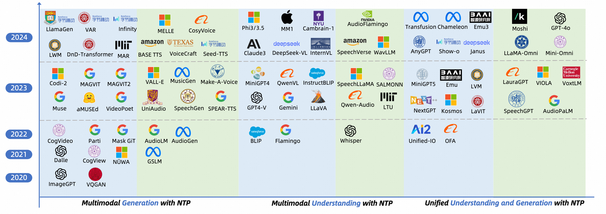

<h1 align="center">Next Token Prediction Towards Multimodal Intelligence</h1>

Building on the foundations of language modeling in natural language processing, Next Token Prediction (NTP) has evolved into a versatile training objective for machine learning tasks across various modalities, achieving considerable success in both understanding and generation tasks. This repo features a comprehensive paper and repos collection for the survey: "Next Token Prediction Towards Multimodal Intelligence: A Comprehensive Survey". 

## 🔥🔥 News
- 2024.12.15: We release the survey and this repo at GitHub! Feel free to make pull requests to add the latest work ~ 

## 📑 Table of Contents

1. [Awesome Multimodal Tokenizers](#awesome-multimodal-tokenizers)
   - 1.1 [Vision](#vision-tokenizer)
   - 1.2 [Audio](#audio-tokenizer)
2. [Awesome MMNTP Models](#awesome-mmntp-models)
   - 2.1 [Vision](#vision-model)
   - 2.2 [Audio](#audio-model)
3. [Awesome Multimodal Prompt Engineering](#awesome-multimodal-prompt-engineering) 
   - 3.1 [Multimodal ICL](#multimodal-icl)
   - 3.2 [Multimodal CoT](#multimodal-cot)

---

## Awesome Multimodal Tokenizers

### Vision Tokenizer

| **Paper** | **Time** | **Modality** | **Tokenization Type** | **GitHub** |
|-----------|----------|--------------|-----------------------|-------------|
| [Qwen2-VL: Enhancing Vision-Language Model's Perception of the World at Any Resolution (QwenVL2-ViT)](https://arxiv.org/abs/2409.12191) | 2024 | Image,Video | Continuous |  |
| [Visual Autoregressive Modeling: Scalable Image Generation via Next-Scale Prediction](https://arxiv.org/abs/2404.02905) | 2024 | Image | Discrete |  |
| [SPAE: Semantic Pyramid AutoEncoder for Multimodal Generation with Frozen LLMs](https://arxiv.org/abs/2306.17842) | 2023 | Image | Discrete | - |
| [Unified Language-Vision Pretraining in LLM with Dynamic Discrete Visual Tokenization](https://arxiv.org/abs/2309.04669) | 2023 | Image | Discrete |  |
| [Language Model Beats Diffusion -- Tokenizer is Key to Visual Generation](https://arxiv.org/abs/2310.05737) | 2023 | Image,Video | Discrete | - |
| [InternVL: Scaling up Vision Foundation Models and Aligning for Generic Visual-Linguistic Tasks](https://arxiv.org/abs/2312.14238) | 2023 | Image | Continuous |  |
| [Patch n' Pack: NaViT, a Vision Transformer for any Aspect Ratio and Resolution](https://arxiv.org/abs/2307.06304) | 2023 | Image | Continuous | - |
| [Planting a SEED of Vision in Large Language Model](https://arxiv.org/abs/2307.08041) | 2023 | Image | Discrete |  |
| [SAM-CLIP: Merging Vision Foundation Models towards Semantic and Spatial Understanding](https://arxiv.org/abs/2310.15308) | 2023 | Image | Continuous | - |
| [EVA-CLIP: Improved Training Techniques for CLIP at Scale](https://arxiv.org/abs/2303.15389) | 2023 | Image | Continuous | [Github](https://github.com/baaivision/EVA/tree/master/EVA-CLIP) |
| [MAGVIT: Masked Generative Video Transformer](https://arxiv.org/abs/2212.05199) | 2022 | Video | Discrete |  |
| [Phenaki: Variable Length Video Generation From Open Domain Textual Description](https://arxiv.org/abs/2210.02399) | 2022 | Video | Discrete | - |
| [CoCa: Contrastive Captioners are Image-Text Foundation Models](https://arxiv.org/abs/2205.01917) | 2022 | Image | Continuous | - |
| [Autoregressive Image Generation using Residual Quantization](https://arxiv.org/abs/2203.01941) | 2022 | Image | Discrete | - |
| [ACAV100M: Automatic Curation of Large-Scale Datasets for Audio-Visual Video Representation Learning](https://arxiv.org/pdf/2101.10803) | 2022 | Image | Continuous |  |
| [FlexiViT: One Model for All Patch Sizes](https://arxiv.org/abs/2212.08013) | 2022 | Image | Continuous |  |
| [Vector-quantized Image Modeling with Improved VQGAN](https://arxiv.org/pdf/2110.04627) | 2021 | Image | Discrete | - |
| [ViViT: A Video Vision Transformer](https://arxiv.org/pdf/2103.15691) | 2021 | Video | Continuous | [Github](https://github.com/google-research/scenic/tree/main/scenic/projects/vivit) |
| [BEIT: BERT Pre-Training of Image Transformers](https://arxiv.org/pdf/2106.08254) | 2021 | Image | Continuous | [Github](https://github.com/microsoft/unilm/tree/master/beit) |
| [High-Performance Large-Scale Image Recognition Without Normalization](https://arxiv.org/abs/2102.06171) | 2021 | Image | Continuous | [Github](https://github.com/google-deepmind/deepmind-research/tree/master/nfnets) |
| [Learning Transferable Visual Models From Natural Language Supervision (CLIP)](https://arxiv.org/abs/2103.00020) | 2021 | Image | Continuous |  |
| [Taming Transformers for High-Resolution Image Synthesis](https://arxiv.org/abs/2012.09841) | 2020 | Image | Discrete |  |
| [Generating Diverse High-Fidelity Images with VQ-VAE-2](https://arxiv.org/abs/1906.00446) | 2019 | Image | Discrete |  |
| [Temporal 3D ConvNets: New Architecture and Transfer Learning for Video Classification](https://arxiv.org/abs/1711.08200) | 2017 | Video | Continuous |  |
| [Neural Discrete Representation Learning (VQVAE)](https://arxiv.org/abs/1711.00937) | 2017 | Image, Video, Audio | Discrete | - |

### Audio Tokenizer
| **Paper** | **Time** | **Modality** | **Tokenization Type** | **GitHub** |
|-----------|----------|--------------|----------|----------|
| [Moshi: a speech-text foundation model for real-time dialogue (Mimi)](https://arxiv.org/abs/2410.00037) | 2024  | Audio | Discrete |  |
| [WavTokenizer: an Efficient Acoustic Discrete Codec Tokenizer for Audio Language Modeling](https://arxiv.org/abs/2408.16532) | 2024  | Audio | Discrete |  |
| [SemantiCodec: An Ultra Low Bitrate Semantic Audio Codec for General Sound](https://arxiv.org/abs/2405.00233) | 2024  | Audio | Discrete |  |
| [NaturalSpeech 3: Zero-Shot Speech Synthesis with Factorized Codec and Diffusion Models (FACodec)](https://arxiv.org/abs/2403.03100) | 2024  | Audio | Discrete | - |
| [SpeechTokenizer: Unified Speech Tokenizer for Speech Large Language Models](https://arxiv.org/abs/2308.16692) | 2023  | Audio | Discrete |  |
| [HiFi-Codec: Group-residual Vector quantization for High Fidelity Audio Codec](https://arxiv.org/abs/2305.02765) | 2023  | Audio | Discrete |  |
| [LMCodec: A Low Bitrate Speech Codec With Causal Transformer Models](https://arxiv.org/abs/2303.12984) | 2023  | Audio | Discrete | - |
| [High-Fidelity Audio Compression with Improved RVQGAN (DAC)](https://arxiv.org/abs/2306.06546) | 2023  | Audio | Discrete |  |
| [Google USM: Scaling Automatic Speech Recognition Beyond 100 Languages](https://arxiv.org/abs/2303.01037) | 2023  | Audio | Continuous | - |
| [High Fidelity Neural Audio Compression (Encodec)](https://arxiv.org/abs/2210.13438) | 2022  | Audio | Discrete |  |
| [CLAP: Learning Audio Concepts From Natural Language Supervision](https://arxiv.org/abs/2206.04769) | 2022  | Audio | Continuous |  |
| [Robust Speech Recognition via Large-Scale Weak Supervision (Whisper)](https://arxiv.org/abs/2212.04356) | 2022  | Audio | Continuous |  |
| [data2vec: A General Framework for Self-supervised Learning in Speech, Vision and Language](https://arxiv.org/abs/2202.03555) | 2022  | Audio | Continuous |  |
| [WavLM: Large-Scale Self-Supervised Pre-Training for Full Stack Speech Processing](https://arxiv.org/abs/2110.13900) | 2021   | Audio | Continuous |  |
| [HuBERT: Self-Supervised Speech Representation Learning by Masked Prediction of Hidden Units](https://arxiv.org/abs/2106.07447) | 2021   | Audio | Continuous |  |
| [SoundStream: An End-to-End Neural Audio Codec](https://arxiv.org/abs/2107.03312) | 2021     | Audio | Discrete | - |
| [wav2vec 2.0: A Framework for Self-Supervised Learning of Speech Representations](https://arxiv.org/abs/2006.11477) | 2020     | Audio | Continuous |  |
| [vq-wav2vec: Self-Supervised Learning of Discrete Speech Representations](https://arxiv.org/abs/1910.05453) | 2019     | Audio | Discrete |  |

## Awesome MMNTP Models

### Vision Model

| **Paper** | **Time** | **Modality** | **Model Type** | **Task** | **GitHub** |
|-----------|----------|--------------|----------------|----------|------------|
| [Randomized Autoregressive Visual Generation (RAR)](https://arxiv.org/abs/2411.00776) | 2024 | Image | Unified | Text2Image |  |
| [Mono-InternVL: Pushing the Boundaries of Monolithic Multimodal Large Language Models with Endogenous Visual Pre-training (MonoInternVL)](https://arxiv.org/abs/2410.08202) | 2024 | Image | Unified | Image2Text | - |
| [A Single Transformer for Scalable Vision-Language Modeling (SOLO)](https://arxiv.org/abs/2407.06438) | 2024 | Image | Unified | Image2Text | - |
| [Unveiling Encoder-Free Vision-Language Models (EVE)](https://arxiv.org/abs/2406.11832) | 2024 | Image | Unified | Image2Text |  |
| [Qwen2-VL: Enhancing Vision-Language Model's Perception of the World at Any Resolution (Qwen2VL)](https://arxiv.org/abs/2409.12191) | 2024 | Image | Compositional | Image2Text |  |
| [Janus: Decoupling Visual Encoding for Unified Multimodal Understanding and Generation (Janus)](https://arxiv.org/abs/2410.13848) | 2024 | Image | Compositional | Image2Text, Text2Image |  |
| [Emu3: Next-Token Prediction is All You Need (Emu3)](https://arxiv.org/abs/2409.18869) | 2024 | Image, Video | Unified | Image2Text, Text2Image, Text2Video |  |
| [Show-o: One Single Transformer to Unify Multimodal Understanding and Generation (Show-o)](https://arxiv.org/abs/2408.12528) | 2024 | Image, Video | Unified | Image2Text, Text2Image, Text2Video |  |
| [VILA-U: a Unified Foundation Model Integrating Visual Understanding and Generation (VILA-U)](https://arxiv.org/abs/2409.04429) | 2024 | Image, Video | Unified | Image2Text, Text2Image, Text2Video |  |
| [Transfusion: Predict the Next Token and Diffuse Images with One Multi-Modal Model (Transfusion)](https://arxiv.org/abs/2408.11039) | 2024 | Image | Unified | Image2Text | - |
| [Fluid: Scaling Autoregressive Text-to-image Generative Models with Continuous Tokens (Fluid)](https://arxiv.org/abs/2410.13863) | 2024 | Image | Unified | Image2Text | - |
| [Autoregressive Image Generation without Vector Quantization (MAR)](https://arxiv.org/abs/2406.11838) | 2024 | Image | Unified | Image2Text |  |
| [Chameleon: Mixed-Modal Early-Fusion Foundation Models (Chameleon)](https://arxiv.org/abs/2405.09818) | 2024 | Image | Unified | Image2Text, Text2Image |  |
| [Mini-Gemini: Mining the Potential of Multi-modality Vision Language Models (Mini-Genimi)](https://arxiv.org/abs/2403.18814) | 2024 | Image | Compositional | Image2Text, Text2Image |  |
| [A Spark of Vision-Language Intelligence: 2-Dimensional Autoregressive Transformer for Efficient Finegrained Image Generation (DnD-Transformer)](https://arxiv.org/abs/2410.01912) | 2024 | Image | Unified | Text2Image |  |
| [Visual Autoregressive Modeling: Scalable Image Generation via Next-Scale Prediction (VAR)](https://arxiv.org/abs/2404.02905) | 2024 | Image | Unified | Text2Image |  |
| [Autoregressive Model Beats Diffusion: Llama for Scalable Image Generation (LlamaGen)](https://arxiv.org/abs/2406.06525) | 2024 | Image | Unified | Text2Image |  |
| [MiniGPT-5: Interleaved Vision-and-Language Generation via Generative Vokens (MiniGPT5)](https://arxiv.org/abs/2310.02239) | 2023 | Image | Compositional | Image2Text, Text2Image |  |
| [BLIP-Diffusion: Pre-trained Subject Representation for Controllable Text-to-Image Generation and Editing (Blip-Diffusion)](https://arxiv.org/abs/2305.14720) | 2023 | Image | Compositional | Text2Image |  |
| [Kosmos-G: Generating Images in Context with Multimodal Large Language Models (Kosmos-G)](https://arxiv.org/abs/2310.02992) | 2023 | Image | Compositional | Text2Image |  |
| [Unified Language-Vision Pretraining in LLM with Dynamic Discrete Visual Tokenization (LaVIT)](https://arxiv.org/abs/2309.04669) | 2023 | Image | Compositional | Image2Text, Text2Image |  |
| [Generative Multimodal Models are In-Context Learners (Emu2)](https://arxiv.org/abs/2312.13286) | 2023 | Image | Compositional | Image2Text, Text2Image |  |
| [Generative Pretraining in Multimodality (Emu1)](https://arxiv.org/abs/2307.05222) | 2023 | Image | Compositional | Image2Text, Text2Image |  |
| [Unified-IO 2: Scaling Autoregressive Multimodal Models with Vision, Language, Audio, and Action (Unified-IO2)](https://arxiv.org/abs/2312.17172) | 2023 | Image, Video, Audio | Compositional | Image2Text, Text2Image, Audio2Text, Text2Audio, Text2Video |  |
| [Language Is Not All You Need: Aligning Perception with Language Models (Kosmos-1)](https://arxiv.org/abs/2302.14045) | 2023 | Image | Compositional | Image2Text |  |
| [InternVL: Scaling up Vision Foundation Models and Aligning for Generic Visual-Linguistic Tasks (InternVL)](https://arxiv.org/abs/2312.14238) | 2023 | Image | Compositional | Image2Text |  |
| [Qwen-VL: A Versatile Vision-Language Model for Understanding, Localization, Text Reading, and Beyond (QwenVL)](https://arxiv.org/abs/2308.12966) | 2023 | Image | Compositional | Image2Text |  |
| [Molmo and PixMo: Open Weights and Open Data for State-of-the-Art Multimodal Models (Molom)](https://arxiv.org/abs/2409.17146) | 2023 | Image | Compositional | Image2Text | -) |
| [Fuyu-8B: A Multimodal Architecture for AI Agents (Fuyu)](https://www.adept.ai/blog/fuyu-8b) | 2023 | Image | Unified | Image2Text | - |
| [Blip-2: Bootstrapping language-image pre-training with frozen image encoders and large language models (BLIP2)](https://arxiv.org/abs/2301.12597) | 2023 | Image | Compositional | Image2Text |  |
| [Visual Instruction Tuning (LLaVA)](https://arxiv.org/abs/2304.08485) | 2023 | Image | Compositional | Image2Text |  |
| [MiniGPT4: a Visual Language Model for Few-Shot Learning (MiniGPT4)](https://arxiv.org/abs/2204.14198) | 2022 | Image | Compositional | Image2Text | - |
| [Unified-IO: A Unified Model for Vision, Language, and Multi-Modal Tasks (Unified-IO)](https://arxiv.org/abs/2206.08916) | 2022 | Image | Compositional | Image2Text, Text2Image | - |
| [Zero-Shot Text-to-Image Generation (DALLE)](https://arxiv.org/abs/2102.12092) | 2022 | Image | Unified | Text2Image | - |
| [Flamingo: a Visual Language Model for Few-Shot Learning (Flamingo)](https://arxiv.org/abs/2204.14198) | 2022 | Image | Compositional | Image2Text | - |

### Audio Model

| **Paper** | **Time** | **Modality** | **Model Type** | **Task** | **GitHub** |
|-----------|----------|--------------|----------------|----------|------------|
| [VoxtLM: Unified Decoder-Only Models for Consolidating Speech Recognition, Synthesis and Speech, Text Continuation Tasks (VoxtLM)](https://arxiv.org/abs/2309.07937) | 2024 | Audio | Unified | A2T, T2A, A2A, T2T | - |
| [Moshi: a speech-text foundation model for real-time dialogue (Moshi)](https://arxiv.org/abs/2410.00037) | 2024 | Audio | Unified | A2A |  |
| [Mini-Omni: Language Models Can Hear, Talk While Thinking in Streaming (Mini-Omni)](https://arxiv.org/abs/2408.16725) | 2024 | Audio | Compositional | A2A |  |
| [LLaMA-Omni: Seamless Speech Interaction with Large Language Models (LLaMA-Omni)](https://arxiv.org/abs/2409.06666) | 2024 | Audio | Compositional | A2A |  |
| [SpeechVerse: A Large-scale Generalizable Audio Language Model (SpeechVerse)](https://arxiv.org/abs/2405.08295) | 2024 | Audio | Compositional | A2T | - |
| [Audio Flamingo: A Novel Audio Language Model with Few-Shot Learning and Dialogue Abilities (AudioFlamingo)](https://arxiv.org/abs/2402.01831) | 2024 | Audio | Compositional | A2T |  |
| [WavLLM: Towards Robust and Adaptive Speech Large Language Model (WavLLM)](https://arxiv.org/abs/2404.00656) | 2024 | Audio | Compositional | A2T |  |
| [MELLE: Autoregressive Speech Synthesis without Vector Quantization](https://arxiv.org/abs/2407.08551) | 2024 | Audio | Unified | T2A | - |
| [Seed-TTS: A Family of High-Quality Versatile Speech Generation Models (Seed-TTS)](https://arxiv.org/abs/2406.02430) | 2024 | Audio | Compositional | T2A | - |
| [FireRedTTS: A Foundation Text-To-Speech Framework for Industry-Level Generative Speech Applications (FireRedTTS)](https://www.arxiv.org/abs/2409.03283) | 2024 | Audio | Compositional | T2A |  |
| [CosyVoice: A Scalable Multilingual Zero-shot Text-to-speech Synthesizer based on Supervised Semantic Tokens (CosyVoice)](https://arxiv.org/abs/2407.05407) | 2024 | Audio | Compositional | T2A |  |
| [Uniaudio: An audio foundation model toward universal audio generation (UniAudio)](https://arxiv.org/abs/2310.00704) | 2024 | Audio | Unified | T2A, A2A |  |
| [BASE TTS: Lessons from building a billion-parameter text-to-speech model on 100K hours of data (BASE TTS)](https://arxiv.org/abs/2402.08093) | 2024 | Audio | Unified | T2A | - |
| [VoiceCraft: Zero-Shot Speech Editing and Text-to-Speech in the Wild (VoiceCraft)](https://arxiv.org/abs/2403.16973) | 2024 | Audio | Unified | T2A |  |
| [Speechgpt: Empowering large language models with intrinsic cross-modal conversational abilities (SpeechGPT)](https://arxiv.org/abs/2305.11000) | 2023 | Audio | Unified | A2T, T2A, A2A, T2T |  |
| [Lauragpt: Listen, attend, understand, and regenerate audio with gpt (LauraGPT)](https://arxiv.org/abs/2310.04673) | 2023 | Audio | Unified | A2T, T2A, A2A, T2T | - |
| [Viola: Unified codec language models for speech recognition, synthesis, and translation (VIOLA)](https://arxiv.org/abs/2305.16107) | 2023 | Audio | Compositional | A2T, T2A, A2A, T2T | - |
| [Audiopalm: A large language model that can speak and listen (AudioPaLM)](https://arxiv.org/abs/2306.12925) | 2023 | Audio | Compositional | A2T, T2A, A2A | - |
| [Qwen-audio: Advancing universal audio understanding via unified large-scale audio-language models (Qwen-Audio)](https://arxiv.org/abs/2311.07919) | 2023 | Audio | Compositional | A2T |  |
| [Salmonn: Towards generic hearing abilities for large language models (SALMONN)](https://arxiv.org/abs/2310.13289) | 2023 | Audio | Compositional | A2T |  |
| [On decoder-only architecture for speech-to-text and large language model integration (SpeechLLaMA)](https://arxiv.org/abs/2307.03917) | 2023 | Audio | Compositional | A2T | - |
| [Listen, think, and understand (LTU)](https://arxiv.org/abs/2305.10790) | 2023 | Audio | Compositional | A2T |  |
| [Pengi: An audio language model for audio tasks (Pengi)](https://arxiv.org/abs/2305.11834) | 2023 | Audio | Compositional | A2T |  |
| [Music Understanding LLaMA: Advancing Text-to-Music Generation with Question Answering and Captioning (MU-LLaMA)](https://arxiv.org/abs/2308.11276) | 2023 | Audio | Compositional | A2T | - |
| [SpeechGen: Unlocking the Generative Power of Speech Language Models with Prompts (SpeechGen)](https://arxiv.org/abs/2306.02207) | 2023 | Audio | Unified | T2A |  |
| [Neural Codec Language Models are Zero-Shot Text to Speech Synthesizers (VALL-E)](https://arxiv.org/abs/2301.02111) | 2023 | Audio | Compositional | T2A |  |
| [Simple and Controllable Music Generation (MusicGen)](https://arxiv.org/abs/2306.05284) | 2023 | Audio | Unified | T2A |  |
| [Make-A-Voice: Unified Voice Synthesis With Discrete Representation (Make-A-Voice)](https://arxiv.org/abs/2305.19269) | 2023 | Audio | Compositional | T2A | - |
| [Speak, Read and Prompt: High-Fidelity Text-to-Speech with Minimal Supervision (SPEAR-TTS)](https://arxiv.org/abs/2302.03540) | 2023 | Audio | Compositional | T2A | - |
| [AudioGen: Textually Guided Audio Generation (AudioGen)](https://arxiv.org/abs/2209.15352) | 2022 | Audio | Unified | T2A | - |
| [AudioLM: a Language Modeling Approach to Audio Generation (AudioLM)](https://arxiv.org/abs/2209.03143) | 2022 | Audio | Compositional | A2A | - |
| [Generative Spoken Language Modeling from Raw Audio (GSLM)](https://arxiv.org/abs/2102.01192) | 2021 | Audio | Unified | A2A | - |

## Awesome Multimodal Prompt Engineering 

### Multimodal ICL

| **Paper** | **Time** | **Modality** | **GitHub** |
|-----------|----------|--------------|-------------|
| [Multimodal Few-Shot Learning with Frozen Language Models (Frozen)](https://arxiv.org/abs/2106.13884) | 2021 | Image | - |
| [Flamingo: a Visual Language Model for Few-Shot Learning (Flamingo)](https://arxiv.org/abs/2204.14198) | 2022 | Image | - |
| [MMICL: Empowering Vision-language Model with Multi-Modal In-Context Learning (MMICL)](https://arxiv.org/abs/2309.07915) | 2023 | Image |  |
| [Efficient In-Context Learning in Vision-Language Models for Egocentric Videos (EILeV)](https://arxiv.org/abs/2311.17041) | 2023 | Image |  |
| [OpenFlamingo: An Open-Source Framework for Training Large Autoregressive Vision-Language Models (Open-Flamingo)](https://arxiv.org/abs/2308.01390) | 2023 | Image |  |
| [Link-Context Learning for Multimodal LLMs (LCL)](https://arxiv.org/abs/2308.07891) | 2023 | Image |  |
| [Med-Flamingo: a Multimodal Medical Few-shot Learner (Med-Flamingo)](https://arxiv.org/abs/2307.15189) | 2023 | Image |  |
| [MIMIC-IT: Multi-Modal In-Context Instruction Tuning (MIMIC-IT)](https://arxiv.org/abs/2306.05425) | 2023 | Image |  |
| [Sequential Modeling Enables Scalable Learning for Large Vision Models (LVM)](https://arxiv.org/abs/2312.00785) | 2023 | Image |  |
| [World Model on Million-Length Video And Language With Blockwise RingAttention (LWM)](https://arxiv.org/abs/2402.08268) | 2023 | Image, Video |  |
| [Exploring Diverse In-Context Configurations for Image Captioning (Yang et al.)](https://github.com/yongliang-wu/ExploreCfg) | 2024 | Image |  |
| [Visual In-Context Learning for Large Vision-Language Models (VisualICL)](https://aclanthology.org/2024.findings-acl.940/) | 2024 | Image | - |
| [Many-Shot In-Context Learning in Multimodal Foundation Models (Many-Shots ICL)](https://arxiv.org/abs/2405.09798) | 2024 | Image |  |
| [Can MLLMs Perform Text-to-Image In-Context Learning? (CoBSAT)](https://arxiv.org/abs/2402.01293) | 2024 | Image |  |
| [Video In-context Learning (Video ICL)](https://arxiv.org/abs/2407.07356) | 2024 | Video |  |
| [Generative Pretraining in Multimodality (Emu)](https://arxiv.org/abs/2307.05222) | 2024 | Image, Video |  |
| [Generative Multimodal Models are In-Context Learners (Emu2)](https://arxiv.org/abs/2312.13286) | 2024 | Image, Video |  |
| [Towards More Unified In-context Visual Understanding (Sheng et al.)](https://arxiv.org/abs/2312.02520) | 2024 | Image | - |
| [Neural Codec Language Models are Zero-Shot Text to Speech Synthesizers (VALL-E)](https://arxiv.org/abs/2301.02111) | 2023 | Audio |  |
| [MELLE: Autoregressive Speech Synthesis without Vector Quantization (MELLE)](https://arxiv.org/abs/2407.08551) | 2024 | Audio | - |
| [Seed-TTS: A Family of High-Quality Versatile Speech Generation Models (Seed-TTS)](https://arxiv.org/abs/2406.02430) | 2024 | Audio | - |
| [Audio Flamingo: A Novel Audio Language Model with Few-Shot Learning and Dialogue Abilities (Audio Flamingo)](https://arxiv.org/abs/2402.01831) | 2024 | Audio |  |
| [Moshi: a speech-text foundation model for real-time dialogue (Moshi)](https://arxiv.org/abs/2410.00037) | 2024 | Audio |  |

### Multimodal CoT

| **Paper** | **Time** | **Modality**  | **GitHub** |
|-----------|----------|--------------|-------------|
| [WavLLM: Towards Robust and Adaptive Speech Large Language Model (WavLLM)](https://arxiv.org/abs/2404.00656) | 2024 | Audio |  |
| [SpeechVerse: A Large-scale Generalizable Audio Language Model (SpeechVerse)](https://arxiv.org/abs/2405.08295) | 2024 | Audio | - |
| [CoT-ST: Enhancing LLM-based Speech Translation with Multimodal Chain-of-Thought](https://arxiv.org/abs/2409.19510) | 2024 | Audio |  |
| [Chain-of-Thought Prompting for Speech Translation](https://arxiv.org/abs/2409.11538) | 2024 | Audio | - |
| [Video-of-Thought: Step-by-Step Video Reasoning from Perception to Cognition](https://openreview.net/pdf?id=fO31YAyNbI) | 2024 | Video | |
| [VideoCoT: A Video Chain-of-Thought Dataset with Active Annotation Tool](https://arxiv.org/pdf/2407.05355) | 2024 | Video | - |
| [Visual CoT: Advancing Multi-Modal Language Models with a Comprehensive Dataset and Benchmark for Chain-of-Thought Reasoning](https://arxiv.org/pdf/2403.16999) | 2024 | Image | |
| [CogCoM: Train Large Vision-Language Models Diving into Details through Chain of Manipulations](https://arxiv.org/pdf/2402.04236) | 2024 | Image | |
| [Compositional Chain-of-Thought Prompting for Large Multimodal Model](https://arxiv.org/pdf/2311.17076) | 2023 | Image | |
| [V∗: Guided Visual Search as a Core Mechanism in Multimodal LLMs](https://arxiv.org/pdf/2312.14135) | 2023 | Image | |
| [DDCoT: Duty-Distinct Chain-of-Thought Prompting for Multimodal Reasoning in Language Models](https://arxiv.org/pdf/2310.16436) | 2023 | Image | |
| [Visual Chain-of-Thought Diffusion Models](https://arxiv.org/pdf/2303.16187) | 2023 | Image | - |
| [Multimodal Chain-of-Thought Reasoning in Language Models](https://arxiv.org/pdf/2302.00923) | 2023 | Image ||

## Reference

coming soon!

